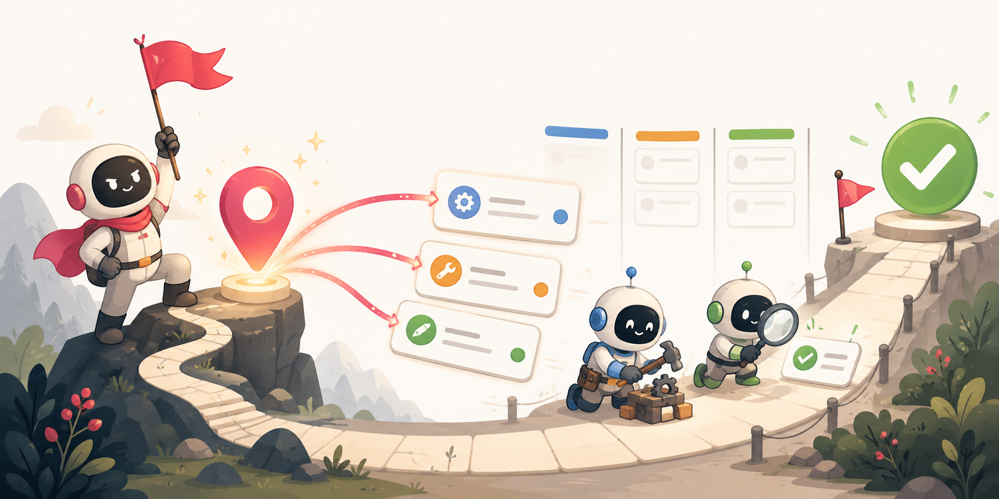
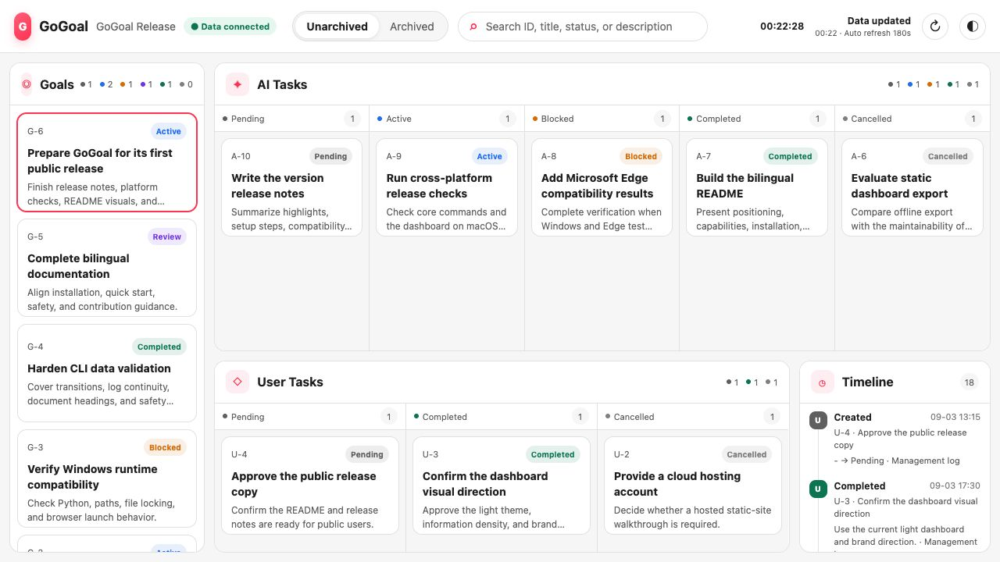

<div align="center">

# GoGoal

### From user-approved goals to visible, verified outcomes.

A portable Agent Skill for planning, executing, tracking, and completing goals.



[English](README.md) · [简体中文](README.zh-CN.md)

[](LICENSE)
[](https://www.python.org/)
[](skills/gogoal/SKILL.md)

</div>

GoGoal turns an explicitly approved goal into a managed execution loop. The primary AI analyzes the goal, decomposes work, chooses sequential or isolated execution, reviews candidate results, validates the combined outcome, and keeps the user informed through structured project data and a local read-only dashboard.

GoGoal follows the portable Agent Skills directory convention. It does not depend on a Codex Plugin, marketplace, package registry, or a specific AI host. Any agent environment that can load `SKILL.md` and run local scripts can integrate it.

## Core capabilities

- Complete lifecycle rules for goals, AI tasks, and user-owned dependencies or decisions.
- Four aggregate JSON files as current structured facts, plus an append-only `log.json` timeline.
- Stable Markdown documents for every goal and AI task, with project-level writing guides that users can customize.
- Adaptive execution: sequential work, Git branches, external worktrees, sub-agents, or a controlled mixture selected by the primary AI.
- Strict validation for schemas, IDs, associations, state transitions, logs, document headings, and common credential patterns.
- Offline, local, read-only dashboard with Chinese and English UI, light and dark themes, filtering, rich record details, timelines, and Markdown/Mermaid rendering.

## How it works

```text
User defines a goal
        ↓
AI analyzes scope and proposes a plan
        ↓
User explicitly approves the plan
        ↓
Primary AI creates and executes tasks
        ↓
Results are integrated and validated
        ↓
User reviews and accepts the goal
```

JSON owns compact lifecycle facts. Markdown owns reasoning, plans, implementation context, validation, delivery, and reviews. The CLI is the only normal writer for structured data, while the dashboard remains read-only.

## Dashboard

The dashboard reads live project data through a local HTTP service. It shows goals, AI tasks, user tasks, status columns, related activity, hover details, and long-form Markdown without rewriting or embedding project data.



```bash
python3.12 <skill-directory>/scripts/gogoal.py dashboard serve --open
```

It listens on `127.0.0.1:4173` by default and refreshes every 180 seconds unless the project configuration overrides those values.

## Installation

Clone the repository, then copy or link the complete [`skills/gogoal`](skills/gogoal) directory into the skill search path exposed by your agent host:

```bash
git clone https://github.com/hijustin/gogoal-skill.git
```

Runtime requirements:

- Python 3.12 or later.
- Git is optional. Without usable Git worktree support, GoGoal safely executes one AI task at a time.
- Chrome or Microsoft Edge is recommended for the local dashboard.
- No global Python or Node package installation is required.

The logical `gogoal` command used in documentation means:

```bash
python3.12 <skill-directory>/scripts/gogoal.py
```

On Windows, use the available Python launcher when appropriate:

```powershell
py -3.12 <skill-directory>\scripts\gogoal.py --version
```

## Quick start

From the project you want to manage:

```bash
python3.12 <skill-directory>/scripts/gogoal.py init \
  --project "Example project" \
  --locale en-US

python3.12 <skill-directory>/scripts/gogoal.py goal create \
  --title "Ship the project" \
  --description "Complete implementation, documentation, and release readiness"
```

The primary AI then writes the returned goal document according to `gogoal/goal-writing.md`, validates it, and waits for explicit approval before starting the goal:

```bash
python3.12 <skill-directory>/scripts/gogoal.py validate
python3.12 <skill-directory>/scripts/gogoal.py goal start 1
python3.12 <skill-directory>/scripts/gogoal.py dashboard serve --open
```

See the [CLI reference](skills/gogoal/references/cli-reference.md), [workflow](skills/gogoal/references/workflow.md), and [document contract](skills/gogoal/references/document-contract.md) for the complete runtime behavior.

To explore a ready-made project without creating data:

```bash
cd examples/demo-project
python3.12 ../../skills/gogoal/scripts/gogoal.py validate --strict
python3.12 ../../skills/gogoal/scripts/gogoal.py dashboard serve --open
```

## Project data

After initialization, GoGoal keeps all management data in one project-local directory:

```text
gogoal/
├── config.json            # Project, locale, execution, Git, and dashboard settings
├── goal-writing.md        # User-customizable goal-document writing guide
├── task-writing.md        # User-customizable AI-task writing guide
├── target.json            # Active goals
├── target-archive.json    # Archived goals
├── task.json              # Active AI and user tasks
├── task-archive.json      # Archived AI and user tasks
├── log.json               # Append-only management timeline
├── targets/<id>.md        # Stable goal documents
└── tasks/<id>.md          # Stable AI-task documents
```

## Safety boundaries

- The CLI modifies only GoGoal management data under the selected project's `gogoal/` directory; it does not implement business changes itself.
- The CLI never commits, pushes, opens pull requests, publishes, or rewrites remote history. `git.autoCommit` only controls whether the primary AI may create a scoped local commit after a complete action.
- The dashboard is read-only. A non-loopback host should be configured only on a trusted network.
- Sub-agents implement assigned work only. They must not mutate GoGoal lifecycle data or documents.
- Do not store passwords, tokens, keys, sensitive personal information, or private production data in JSON, logs, or Markdown.

## Development and contribution

Architecture and design materials live under [`docs/`](docs); the retained dashboard experiment lives under [`prototypes/dashboard/`](prototypes/dashboard). Neither directory is loaded as Skill runtime context.

```bash
/path/to/python3.12 -m unittest discover -s tests -v
/path/to/python3.12 skills/gogoal/scripts/gogoal.py --version
```

Contributions are welcome through issues and pull requests. Please keep runtime instructions portable, structured-data mutations inside the CLI, and user-facing behavior consistent in both supported locales.

## License

GoGoal is licensed under the [Apache License 2.0](LICENSE). Third-party component notices are listed in [THIRD_PARTY_NOTICES.md](THIRD_PARTY_NOTICES.md).
