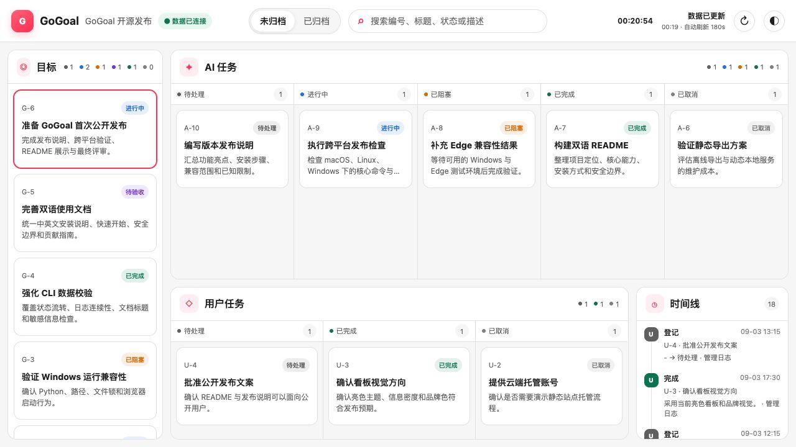

<div align="center">

# GoGoal

### 从用户授权目标，到全程可见、结果可验。

一个用于规划、执行、追踪和完成目标的通用 Agent Skill。


[English](README.md) · [简体中文](README.zh-CN.md)

[](LICENSE)
[](https://www.python.org/)
[](skills/gogoal/SKILL.md)

</div>

GoGoal 将用户明确批准的目标转化为受管理的执行闭环。主 AI 分析目标、拆分任务、选择顺序或隔离执行方式、审查候选结果、验证组合成果，并通过结构化项目数据和本地只读看板让全过程保持可见。

GoGoal 遵循通用的 Agent Skills 目录约定，不依赖 Codex Plugin、Marketplace、包注册中心或特定 AI 宿主。任何能够加载 `SKILL.md` 并运行本地脚本的智能体环境都可以集成它。

## 核心能力

- 目标、AI 任务和需要用户处理的依赖或决策均有完整生命周期规则。
- 四个聚合 JSON 保存结构化当前事实，追加式 `log.json` 保存管理时间线。
- 每个目标和 AI 任务使用稳定 Markdown，用户可在项目内自定义写作指南。
- 主 AI 根据实际情况自主选择顺序执行、Git 分支、仓库外工作树、子代理或受控混合方式。
- 严格校验 schema、编号、关联、状态流转、日志、文档标题及常见凭据模式。
- 离线、本地、只读看板，支持中英文、明暗主题、筛选、完整字段浮框、时间线以及 Markdown/Mermaid 阅读。

## 工作方式

```text
用户提出目标
    ↓
AI 分析范围并提出计划
    ↓
用户明确批准计划
    ↓
主 AI 创建并执行任务
    ↓
整合结果并完成验证
    ↓
用户评审并验收目标
```

JSON 负责紧凑的生命周期事实；Markdown 负责背景、方案、计划、实际实施、验证、交付和评审；CLI 是结构化数据的唯一正常写入入口，看板始终只读。

## 看板

看板通过本地 HTTP 服务动态读取项目数据，统一展示目标、AI 任务、用户任务、状态列、关联活动、悬浮详情和长篇 Markdown，不会把数据写进页面或重复生成页面。



```bash
python3.12 <skill目录>/scripts/gogoal.py dashboard serve --open
```

默认监听 `127.0.0.1:4173`，默认每 180 秒自动获取一次数据；项目配置可以覆盖这些值。

## 安装

克隆仓库，再将完整的 [`skills/gogoal`](skills/gogoal) 目录复制或链接到 AI 宿主提供的 Skill 搜索路径：

```bash
git clone https://github.com/hijustin/gogoal-skill.git
```

运行环境要求：

- Python 3.12 或更高版本。
- Git 为可选依赖；缺少可用的 Git 工作树能力时，GoGoal 会安全降级为一次只执行一个 AI 任务。
- 本地看板推荐使用 Chrome 或 Microsoft Edge。
- 不需要全局安装 Python 包或 Node 包。

文档中的逻辑命令 `gogoal` 表示：

```bash
python3.12 <skill目录>/scripts/gogoal.py
```

Windows 可以按环境使用 Python Launcher：

```powershell
py -3.12 <skill目录>\scripts\gogoal.py --version
```

## 快速开始

在需要管理的项目中执行：

```bash
python3.12 <skill目录>/scripts/gogoal.py init \
  --project "示例项目" \
  --locale zh-CN

python3.12 <skill目录>/scripts/gogoal.py goal create \
  --title "发布项目" \
  --description "完成实现、文档和发布准备"
```

主 AI 随后按照 `gogoal/goal-writing.md` 编写命令返回的目标文档，完成校验，并在用户明确批准后启动目标：

```bash
python3.12 <skill目录>/scripts/gogoal.py validate
python3.12 <skill目录>/scripts/gogoal.py goal start 1
python3.12 <skill目录>/scripts/gogoal.py dashboard serve --open
```

完整运行规则见中文版[命令参考](docs/zh-CN/skill-reference/cli-reference.md)、[工作流](docs/zh-CN/skill-reference/workflow.md)和[文档核心契约](docs/zh-CN/skill-reference/document-contract.md)。Skill 实际加载的英文唯一规范位于 [`skills/gogoal/references/`](skills/gogoal/references)。

无需新建数据也可以直接体验仓库内的示例：

```bash
cd examples/demo-project
python3.12 ../../skills/gogoal/scripts/gogoal.py validate --strict
python3.12 ../../skills/gogoal/scripts/gogoal.py dashboard serve --open
```

## 项目数据

初始化后，GoGoal 将全部管理数据放在项目内的一个目录中：

```text
gogoal/
├── config.json            # 项目、语言、执行、Git 与看板配置
├── goal-writing.md        # 用户可自定义的目标文档写作指南
├── task-writing.md        # 用户可自定义的 AI 任务文档写作指南
├── target.json            # 活动目标
├── target-archive.json    # 已归档目标
├── task.json              # 活动 AI 任务与用户任务
├── task-archive.json      # 已归档 AI 任务与用户任务
├── log.json               # 追加式管理时间线
├── targets/<id>.md        # 稳定目标文档
└── tasks/<id>.md          # 稳定 AI 任务文档
```

## 安全边界

- CLI 只修改所选项目 `gogoal/` 下的管理数据，不直接实施业务改动。
- CLI 永不提交、推送、创建 Pull Request、发布或改写远程历史；`git.autoCommit` 只控制主 AI 是否可以在完整动作后创建范围明确的本地提交。
- 看板只读；非回环监听地址只应在可信网络中配置。
- 子代理只实施被派发的任务，不得修改 GoGoal 生命周期数据或文档。
- JSON、日志和 Markdown 中不得保存密码、令牌、密钥、个人敏感信息或生产隐私数据。

## 开发与贡献

架构和设计材料位于 [`docs/`](docs)，保留的看板实验原型位于 [`prototypes/dashboard/`](prototypes/dashboard)；两者都不会作为 Skill 运行时上下文加载。

```bash
/path/to/python3.12 -m unittest discover -s tests -v
/path/to/python3.12 skills/gogoal/scripts/gogoal.py --version
```

欢迎通过 Issues 和 Pull Requests 参与贡献。请保持运行时说明可移植、结构化数据变更集中在 CLI 内，并确保所有用户界面行为同时适配中英文。

## 许可证

GoGoal 使用 [Apache License 2.0](LICENSE)。第三方组件说明见 [THIRD_PARTY_NOTICES.md](THIRD_PARTY_NOTICES.md)。
