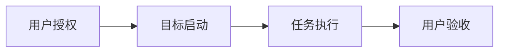

# G-1 发布 GoGoal 通用 Skill

## 1. 目标定义

将已经收敛的目标任务管理规范实现为可在不同 AI 宿主中分发的开放 Agent Skill。交付包含稳定 CLI、项目内数据、可自定义文档、本地只读看板、自动化测试和公开发布材料。

## 2. 实施方案

使用 Python 3.12 标准库实现跨平台 CLI 和 HTTP 服务，浏览器端使用无构建步骤的固定资源。结构化数据只由 CLI 修改；主 AI 管理生命周期，子代理只提交候选实现。

## 3. 任务规划与执行

### AI 任务

| 任务 | 预期结果 | 依赖与执行顺序 | 执行结果摘要 |
| --- | --- | --- | --- |
| [A-1](../tasks/1.md) | 稳定 CLI | 先完成 | 已完成状态机、日志与校验。 |
| [A-2](../tasks/2.md) | 只读看板 | CLI 数据稳定后 | 正在接入真实数据。 |

### 用户任务

| 用户任务 | 类型 | 需要用户处理的内容 | 结果及对目标的影响 |
| --- | --- | --- | --- |
| U-1 | 用户决定 | 确认公开发布说明 | 待处理。 |

## 4. 交付与验收

尚未发生。目标完成后将提供安装、初始化、完整流转和看板验收结果。

## 5. 评审记录

| 时间 | 评审类型 | 评审内容 |
| --- | --- | --- |
| 2026-08-25 09:15 | 计划启动 | 用户批准当前目标、方案与任务规划。 |
